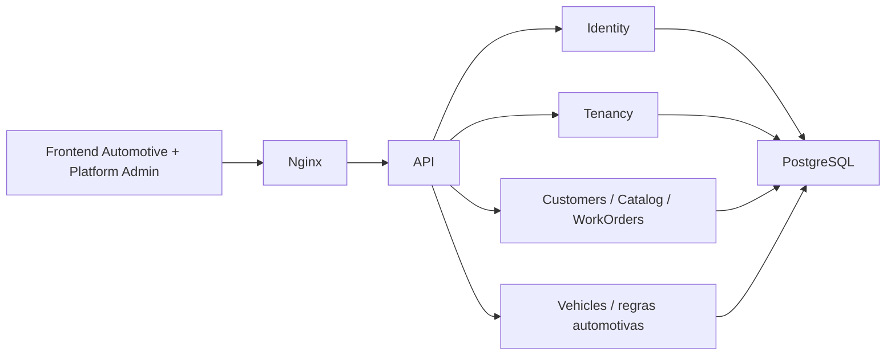

# Arquitetura

O Ofizzy é um monólito modular: uma API, um frontend e um PostgreSQL. A API usa módulos por negócio dentro de um único assembly e um `ApplicationDbContext`. Cada módulo possui seus DTOs, validações, regras e endpoints; não há repositories genéricos, CQRS ou barramento interno.

O Nginx oferece uma origem única: `/api` segue para ASP.NET Core e as demais rotas para Angular. O frontend é standalone, lazy-loaded e usa services/signals sem store global externo.

No frontend, páginas em `features/` funcionam como contêineres de estado e chamadas HTTP, espelhando a modularidade do backend: fluxos universais residem na raiz de `features/` (clientes, catálogo, OS base, configurações), enquanto domínios específicos de nicho ficam organizados sob `features/verticals/<nicho>` (ex: `features/verticals/automotive/vehicles`). Blocos coesos ficam em componentes da própria feature; padrões realmente compartilhados ficam em `shared/`. A responsividade usa CSS nos breakpoints 640/900 px e um serviço baseado em `matchMedia` somente quando o comportamento Angular precisa mudar, como a escolha obrigatória de cards no celular.

O editor de OS mantém uma única fonte de dados na página contêiner e delega a apresentação das linhas ao componente reutilizável de serviços/peças. Cálculos exibidos no navegador são estimativas; o backend continua autoritativo.

Assets estáticos com hash recebem cache imutável e gzip no Nginx. O dashboard usa um endpoint agregado para evitar múltiplas consultas concorrentes no carregamento inicial.

Dependências entre módulos devem ser explícitas e apontar para contratos, nunca para controllers. Regras e cálculos críticos pertencem ao backend.

## Fundação SaaS multi-tenant

A ADR [0006](adr/0006-saas-multi-tenancy.md) substitui a definição single-tenant.
O assembly atual mantém fronteiras por responsabilidade:

| Camada lógica | Implementação atual | Responsabilidade |
| --- | --- | --- |
| SaaS Core | Platform/Authentication, Platform/Tenancy | identidade, sessão, vínculos, autorização, provisionamento e administração |
| TenantSettings | entidade TenantSettings, Platform/Company | dados operacionais/branding, contrato legado `/api/company` |
| Business Core | BusinessCore/Customers, Services, Parts, WorkOrders, Dashboard, Payments | clientes, catálogo, snapshots, cálculos e estados |
| Automotive (Vertical) | Verticals/Automotive (veículos) e campos automotivos da OS | veículo, placa, quilometragem e relacionamento cliente/veículo |
| Infraestrutura | Infrastructure/Persistence, migrations, Nginx | persistência compartilhada e origem única |

`CurrentTenant` é scoped, injetado diretamente e preenchido por
`TenantContextMiddleware` após validar usuário, vínculo e estado no banco.
`TenantAccessFilter` verifica contexto, módulos e papel; PlatformAdmin tem policy
própria com handler injetado. Não há bypass global de filtros para suporte.
Sem tenant, queries operacionais retornam zero registros e escritas falham.
SaveChanges atribui TenantId e impede mudança de proprietário; TenantId também é
token de concorrência. FKs compostas protegem relações, inclusive linhas de OS.
SQL bruto está restrito à numeração, locks de refresh e operações de migration.
Novos acessos operacionais por SQL/ExecuteUpdate exigem revisão explícita: filtros
EF não são RLS PostgreSQL nem sandbox contra código privilegiado malicioso.

`TenantProvisioningService` cria atomicamente Tenant, TenantSettings, módulos e
TenantUser Owner, criando um User somente se necessário. O template Automotive
fornece módulos padrão e valida dependências; não há engine genérica. Uma empresa
pode habilitar apenas Customers/Catalog. OS exige Customers e Catalog; Automotive é opcional e, quando ativo, exige Customers. Veículos históricos permanecem vinculados; novas OS podem operar sem veículo quando a vertical está desabilitada.

Angular centraliza contexto em TenantContextService/AuthService, filtra menu e
protege rotas. A seleção ocorre fora do shell: páginas anteriores são destruídas,
o cache é limpo e a sessão é recarregada. O backend é a autoridade das permissões.

Extrações futuras possíveis: Notifications, Documents/Reports, Integrations,
SaaS Subscriptions e AI/Automation. Nenhum serviço distribuído foi criado.

## Evolução futura: PWA

PWA/offline-first é backlog: service worker, manifesto, IndexedDB e fila de sincronização descritos no planejamento não constituem funcionalidade entregue. Exigirá desenho próprio de conflitos, idempotência e proteção dos dados por tenant. Emissão fiscal depende de comunicação com o órgão autorizado; não presumir autorização offline.

## Módulo fiscal — 27/09/2026

`BusinessCore/Fiscal` integra o Business Core e usa o mesmo DbContext. `features/fiscal` fornece componentes nas configurações e na OS existente. Adaptadores concretos encapsulam NFS-e Nacional e NF-e SP/SVRS; regras, cálculos, assinatura e correlação de protocolos ficam no backend.

Preparação e documentos preservam snapshots; resultados inconclusivos mantêm identidade/XML e exigem consulta. Inutilização usa lease persistido de dois minutos, XML original e confirmação da faixa/protocolo. Produção exige três travas cumulativas (`ProductionEnabled`, allow-list e liberação persistida do tenant). Origem persistida impede operar documentos simulados/desconhecidos com o gateway oficial. Perfis RTC por vigência preservam valores explícitos no snapshot; transmissão RTC oficial continua bloqueada até finalizar a adequação. Veja [decisão fiscal](adr/0007-direct-fiscal-integration.md) e [próximos passos](NEXT-STEPS.md).

## Financeiro manual — 27/09/2026

`BusinessCore/Payments` usa o mesmo DbContext, sem PSP ou dependência de microsserviço. Recebimentos pertencem à OS; alocações referenciam documentos oficiais produtivos da mesma OS. Liquidações e estornos são movimentos imutáveis, com autor, data e idempotência por tenant. FKs compostas e filtros protegem referências; transações serializáveis impedem exceder os saldos. Segregação nula é desconhecida e não representa zero. Cancelamento fiscal exige revisão do vínculo, sem estorno automático. A interface da OS consome APIs reais e persiste no PostgreSQL.
