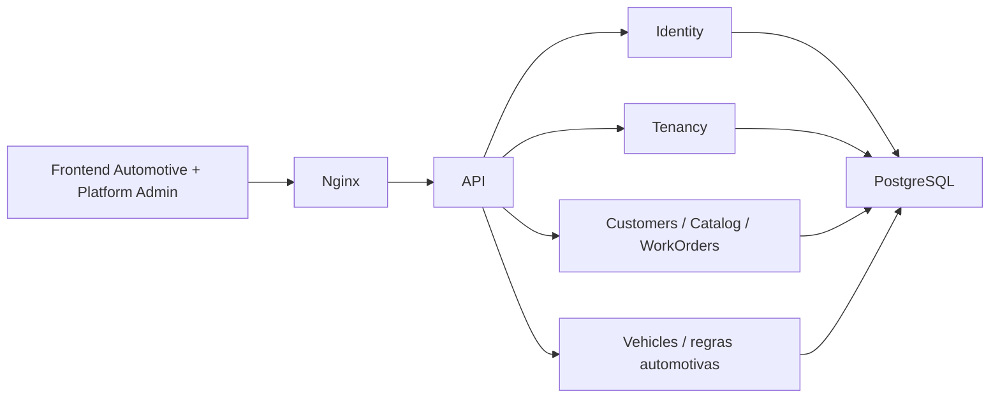

# Arquitetura

O Ofizzy é um monólito modular: uma API, um frontend e um PostgreSQL. A API usa módulos por negócio dentro de um único assembly e um `ApplicationDbContext`. Cada módulo possui seus DTOs, validações, regras e endpoints; não há repositories genéricos, CQRS ou barramento interno.

O Nginx oferece uma origem única: `/api` segue para ASP.NET Core e as demais rotas para Angular. O frontend é standalone, lazy-loaded e usa services/signals sem store global externo.

No frontend, páginas em `features/` funcionam como contêineres de estado e chamadas HTTP. Blocos coesos ficam em componentes da própria feature; padrões realmente compartilhados ficam em `shared/`. A responsividade usa CSS nos breakpoints 640/900 px e um serviço baseado em `matchMedia` somente quando o comportamento Angular precisa mudar, como a escolha obrigatória de cards no celular.

O editor de OS mantém uma única fonte de dados na página contêiner e delega a apresentação das linhas ao componente reutilizável de serviços/peças. Cálculos exibidos no navegador são estimativas; o backend continua autoritativo.

Assets estáticos com hash recebem cache imutável e gzip no Nginx. O dashboard usa um endpoint agregado para evitar múltiplas consultas concorrentes no carregamento inicial.

Dependências entre módulos devem ser explícitas e apontar para contratos, nunca para controllers. Regras e cálculos críticos pertencem ao backend.

## Fundação SaaS multi-tenant

A ADR [0006](adr/0006-saas-multi-tenancy.md) substitui a definição single-tenant.
O assembly atual mantém fronteiras por responsabilidade:

| Camada lógica | Implementação atual | Responsabilidade |
| --- | --- | --- |
| SaaS Core | Authentication, Modules/Tenancy | identidade, sessão, vínculos, autorização, provisionamento e administração |
| TenantSettings | entidade TenantSettings, Modules/Company | dados operacionais/branding, contrato legado `/api/company` |
| Business Core | Customers, Services, Parts, WorkOrders | clientes, catálogo, snapshots, cálculos e estados |
| Automotive | Modules/Vehicles e campos automotivos da OS | veículo, placa, quilometragem e relacionamento cliente/veículo |
| Infraestrutura | ApplicationDbContext, migrations, Nginx | persistência compartilhada e origem única |

`CurrentTenant` é scoped, injetado diretamente e preenchido por
`TenantContextMiddleware` após validar usuário, vínculo e estado no banco.
`TenantAccessFilter` verifica contexto, módulos e papel; PlatformAdmin tem policy
própria com handler injetado. Não há bypass global de filtros para suporte.
Sem tenant, queries operacionais retornam zero registros e escritas falham.
SaveChanges atribui TenantId e impede mudança de proprietário; TenantId também é
token de concorrência. FKs compostas protegem relações, inclusive linhas de OS.
SQL bruto está restrito à numeração, locks de refresh e operações de migration.
Novos acessos operacionais por SQL/ExecuteUpdate exigem revisão explícita: filtros
EF não são RLS PostgreSQL nem sandbox contra código privilegiado malicioso.

`TenantProvisioningService` cria atomicamente Tenant, TenantSettings, módulos e
TenantUser Owner, criando um User somente se necessário. O template Automotive
fornece módulos padrão e valida dependências; não há engine genérica. Uma empresa
pode habilitar apenas Customers/Catalog. O contrato atual de OS ainda exige
Automotive porque Vehicle é obrigatório. Isso é uma dependência explícita da
primeira vertical, não uma implementação fictícia de OS genérica.

Angular centraliza contexto em TenantContextService/AuthService, filtra menu e
protege rotas. A seleção ocorre fora do shell: páginas anteriores são destruídas,
o cache é limpo e a sessão é recarregada. O backend é a autoridade das permissões.

Extrações futuras possíveis: Notifications, Documents/Reports, Integrations,
SaaS Subscriptions e AI/Automation. Nenhum serviço distribuído foi criado.
