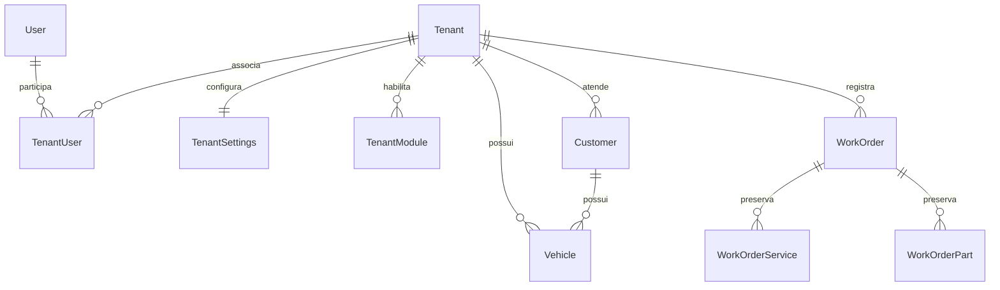

# Modelo de dados

## SaaS Core

- `Tenant`: UUID v7, nome administrativo, slug único, vertical tipada, estado
  Pending/Active/Suspended/Archived, datas, autor de criação/alteração e
  OnboardingCompletedAt explícito. Razão social/documentos ficam nas configurações,
  separadas da identidade administrativa do tenant. TenantSettings mantém dados operacionais; FiscalSettings mantém o cadastro fiscal estruturado da emissão.
- `TenantSettings`: antiga Company; preserva tabela `companies` e seus IDs. FK
  TenantId única. Nome operacional, razão social, CNPJ, contatos, endereço, LogoPath,
  textos de impressão, timezone, moeda e LastWorkOrderNumber. Configurações nunca
  são globais. Nome/textos já alimentam a UI e impressão; upload/editor de logo é futuro.
- `User`: identidade global, email normalizado único, hash, ativo, datas e privilégio
  IsPlatformAdmin com PlatformAdminGrantedAt. Não existe User.TenantId.
- `TenantUser`: PK TenantId/UserId, Role Owner/Admin/Member, IsActive e datas.
- `TenantModule`: PK TenantId/Module, Enabled. Customers, WorkOrders, Catalog,
  Automotive. Dependências de Automotive e do contrato atual de OS são validadas.
- `RefreshToken`: hash SHA-256, família, expiração, revogação/substituição e tenant
  selecionado opcional. Seleção nula permite identidade sem organização ativa.

## Dados operacionais

Customer, Vehicle, ServiceItem, Part, WorkOrder, WorkOrderService e WorkOrderPart
possuem TenantId obrigatório e filtro EF global. Não se aceita propriedade pelo DTO.
Todos os índices operacionais começam por TenantId. Documento de cliente, placa,
código de peça e número da OS são únicos por tenant, inclusive cadastros arquivados.
UUIDs continuam únicos globalmente; chaves alternativas TenantId/Id sustentam FKs.

Vehicle → Customer, WorkOrder → Customer/Vehicle, linhas → WorkOrder e referências
opcionais ao catálogo usam FKs compostas. Catálogo é arquivado; referências usam
RESTRICT, preservando snapshots sem precisar anular TenantId em cascata.
A aplicação ainda valida cliente ativo, vínculo veículo/cliente e catálogo ativo.

OS preserva snapshots e estados Open/InProgress/Completed/Cancelled. Totais são
calculados no backend. Não existem tabelas de pagamentos nesta entrega.

## Numeração e migração

A criação da OS executa UPDATE ... RETURNING em LastWorkOrderNumber da configuração
atual dentro da mesma transação da OS/linhas. O lock da linha serializa concorrentes;
rollback não consome número. Não há MAX + 1 durante operação normal.

AddSaasTenancy cria tenant legado quando existe configuração ou usuário, preenche
TenantId nullable e só depois aplica NOT NULL, unicidade e FKs. Preserva IDs,
snapshots, hashes e números. O contador legado inicia no maior número histórico sob
transação de migration. Banco vazio não recebe empresa fictícia. Mais de uma Company
legada aborta atomicamente com mensagem para mapeamento explícito. Nenhum usuário
legado vira PlatformAdmin automaticamente. Refresh legado recebe o tenant inicial.
Downgrade destrutivo é recusado; rollback exige backup anterior validado.

Convenções: UUID v7, timestamptz/UTC, numeric(14,2) para dinheiro e três casas para
quantidades. Não há banco, schema ou sequência física por tenant.

## Persistência fiscal — 13/09/2026

| Entidade | Responsabilidade |
| --- | --- |
| FiscalSettings | Emitente fiscal estruturado, ambiente e certificado cifrado; separado dos dados operacionais de TenantSettings |
| ProductFiscalProfile / ServiceFiscalProfile | Classificações fiscais vinculadas ao catálogo |
| FiscalPreparation | Dados complementares e snapshots da OS |
| FiscalSequence | Numeração por tenant, tipo, ambiente e série |
| FiscalDocument | Identidade, estado, XML assinado/autorizado, protocolo e concorrência |
| FiscalEvent | Histórico de tentativas e respostas |
| FiscalInutilization | Intervalo, XML original, protocolo, estado e LeaseUntil |

As oito entidades são isoladas por TenantId. FKs compostas e índices por tenant preservam vínculos. Documentos Cancelled=6 e Inutilized=7 saem do índice de documento ativo, permanecendo no histórico. Novas migrations: AddFiscalFoundation, CompleteFiscalInutilization e AddFiscalInutilizationLease. A numeração fiscal é distinta de LastWorkOrderNumber. [Operação](FISCAL.md) e [evolução](NEXT-STEPS.md).
