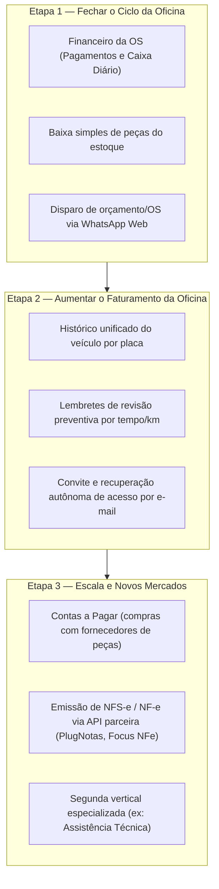

# Estratégia de Produto e Foco de Negócio — Ofizzy

Documento de visão estratégica, posicionamento de mercado e definição de foco para o produto Ofizzy.

---

## 1. O Dilema: ERP Completo vs. Vertical SaaS Especializado

Um ERP tradicional completo (como SAP, Totvs, Bling ou Omie) abrange contabilidade, tributação complexa (SPED, NF-e, NFS-e, retenções de ICMS/PIS/COFINS), gestão avançada de compras, múltiplos almoxarifados, ponto e folha de pagamento.

### Por que o Ofizzy NÃO deve tentar ser um ERP genérico agora?
1. **Escopo infinito:** Um ERP generalista exige anos de desenvolvimento contínuo apenas para atender regras fiscais e contábeis que mudam constantemente no Brasil.
2. **Concorrência saturada:** Competir diretamente com grandes ERPs generalistas coloca o produto em confronto direto com empresas consolidadas.
3. **Complexidade excessiva para o usuário:** Prestadores de serviços e oficinas mecânicas não querem nem precisam de "Centros de Custo", "Planos de Contas" ou "Naturezas de Operação". Eles precisam de um fluxo rápido e simples para abrir OS, diagnosticar, cobrar e entregar o serviço.

### O Verdadeiro Caminho: Vertical SaaS
O Ofizzy posiciona-se como um **Vertical SaaS** (software como serviço verticalizado para um nicho específico):
* **Coração do fluxo de trabalho (*Core of the Workflow*):** O sistema resolve com excelência e sem burocracia o ciclo diário de atendimento da empresa prestadora de serviços.
* **Primeira vertical:** **Automotive (Oficinas Mecânicas, Centros Automotivos e Funilarias)**.
* **Evolução modular:** Novas verticais (assistência técnica, climatização, etc.) reaproveitam o núcleo universal sem inflar o produto com funcionalidades genéricas desnecessárias.

---

## 2. Diagnóstico Atual: O que já existe vs. O que falta para venda real

### O que o Ofizzy já tem (Fundação sólida):
- [x] Multi-tenancy real em banco compartilhado com isolamento estrito por `TenantId`.
- [x] Gestão completa de Clientes, Veículos e Catálogos (Serviços e Peças).
- [x] Ciclo completo de Ordem de Serviço (Abertura, Edição, Transições de Estado, Snapshots e Totais).
- [x] Impressão A4 limpa e geração de PDF oficial com QuestPDF.
- [x] Dashboard operacional com KPIs em tempo real.
- [x] Interface 100% responsiva (Mobile 320px, Tablet e Desktop) com PrimeNG e Tailwind tokens.
- [x] Cobertura de testes unitários, de integração com PostgreSQL real e testes E2E.

### O que REALMENTE FALTA para o dono da oficina abandonar o caderno/planilha:

1. **Financeiro Operacional da OS (Fase 5 do Roadmap):**
   * Registro da forma de pagamento na finalização da OS (Dinheiro, PIX, Cartão de Débito, Cartão de Crédito parcelado).
   * Status financeiro da OS (Pendente, Pago, Parcial).
   * Fechamento e caixa diário básico (quanto entrou em dinheiro vivo, quanto em PIX e quanto em cartão hoje).
2. **Baixa Simples de Estoque de Peças:**
   * Controle de saldo de peças no catálogo: ao concluir a OS, o sistema decrementa o estoque da peça utilizada.
   * Alerta visual de estoque baixo para peças críticas.
3. **Comunicação Direta via WhatsApp:**
   * Botão de 1 clique na OS para enviar orçamento ou aviso de conclusão formatado diretamente para o WhatsApp do cliente.

---

## 3. Trilha de Foco Estratégico (Roadmap em 3 Etapas)

---

## 4. Política de Dados: Arquivamento vs. Exclusão

No Ofizzy, adotou-se o princípio: **"Cadastros são arquivados; documentos históricos não são apagados."**

* **Por que não apagar fisicamente registros com histórico?**
  1. **Integridade de Documentos:** Uma Ordem de Serviço concluída é um documento fiscal e contratual. Excluir o cliente ou veículo causaria quebra de integridade referencial ou destruição do histórico da oficina.
  2. **Garantia e CDC:** O Código de Defesa do Consumidor exige comprovação de garantia (mínimo de 90 dias) e guarda comercial por até 5 anos.
  3. **Segurança contra Erros Operacionais:** O arquivamento lógico permite restaurar dados com um único clique.
* **Evolução planejada:** Permitir a exclusão física (*Hard Delete*) **exclusivamente** para cadastros recém-criados que nunca foram vinculados a nenhuma Ordem de Serviço.
