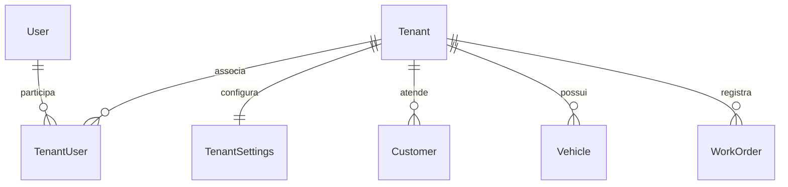
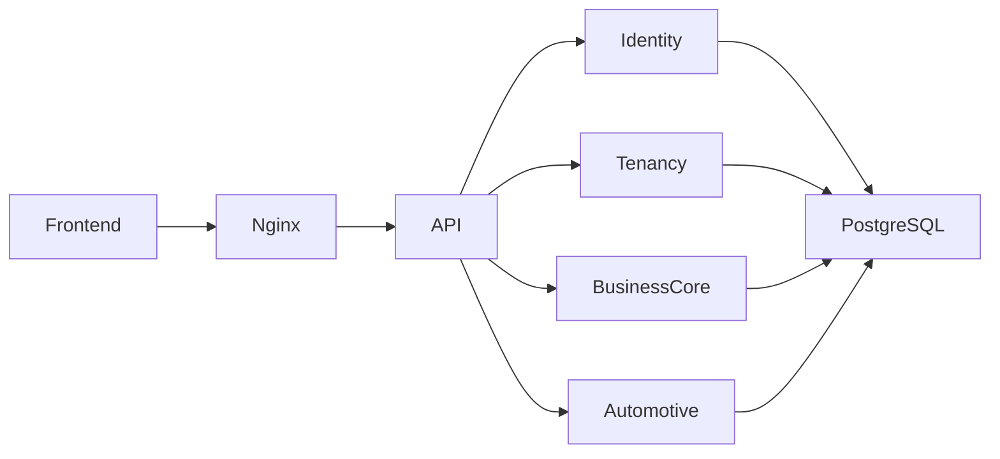

# ADR 0006 — Plataforma SaaS em monólito modular

Data da decisão: 2026-09-09. Decisão aceita. Atualização de 13/09/2026: implementação da fundação SaaS com aceite local concluído; fase fiscal ativa.

## Discovery

A base tem um assembly ASP.NET Core, ApplicationDbContext e módulos Customers,
Vehicles, Services, Parts, WorkOrders, Company e Dashboard. Não há pagamentos.
Identity usa JWT e refresh rotativo em cookies HttpOnly com CSRF. Setup cria
Company e primeiro usuário numa transação serializável. CompanyController contém
fallback fictício e não executa o validator existente: ambos devem ser corrigidos.
OS guarda snapshots e linhas dependentes; PDF lê Company. FKs simples permitem
referências globais. Document, Plate, Code e Number têm índices únicos globais;
Number usa sequence PostgreSQL. Demais índices de consulta precisam prefixo tenant.
Angular tem sessão central, guards, cache GET e navegação única desktop/mobile.
A troca de organização precisa limpar cache e destruir páginas do contexto anterior.
Compose/Nginx e workflows implantam uma única plataforma. E2E visual atual usa
interceptações: não constitui evidência de persistência ou isolamento real.

## Decisão

Tenant é a empresa assinante; Customer é seu cliente operacional. User permanece
global e participa por TenantUser (Owner/Admin/Member, ativo e datas). Nenhum Owner
recebe automaticamente administração da plataforma. Privilégio global é persistido,
com data de concessão, e revalidado no banco. Bootstrap é explicitamente habilitado
pelo operador, somente para instalação vazia. Legados recebem Owner, nunca privilégio
global implicitamente; concessão operacional explícita usa comando administrativo.

Shared database com TenantId reduz custo operacional. Filtros globais EF falham
fechados sem contexto; SaveChanges atribui propriedade e rejeita alteração; FKs
compostas impedem relações cruzadas. Tabelas de controle de identidade/tenancy
são acessadas somente por serviços de autenticação e APIs privilegiadas. Não existe
bypass geral do filtro para administradores. Company vira TenantSettings, preservando
tabela/IDs e rota /api/company durante compatibilidade. Dados fiscais e operacionais
permanecem nas configurações; Tenant guarda nome administrativo, slug e estado.

CurrentTenant é scoped e preenchido após autenticação e validação do vínculo no banco.
Claims de tenant são contexto selecionado, nunca autorização suficiente. Refresh
preserva seleção, revalida vínculo/estado e serializa rotação. Usuário com múltiplos
tenants autentica sem contexto e seleciona por endpoint autorizado.

Provisioning transacional cria tenant, configurações, módulos e Owner. Automotive é
primeiro template; módulos são enum, não flags arbitrárias. WorkOrders atual mantém
contrato Automotive e requer Automotive enquanto Vehicle for obrigatório; futura
vertical adicionará contrato próprio sem duplicar backend. Business Core continua
responsável pelos snapshots, estados e totais. Não implementamos vertical fictícia.

Numeração usa incremento atômico de contador por tenant dentro da transação da OS.
Migration cria tenant legado somente se existem usuários/configuração, preserva IDs,
snapshots e números, preenche TenantId antes de constraints e inicializa contador
pelo maior número existente exclusivamente durante migration sob lock de schema.
Banco vazio não recebe empresa fictícia. Rollback após novos tenants exige restore
de backup: não há downgrade destrutivo para single-tenant.

## Limites e evolução

Continuam uma API, PostgreSQL, frontend principal e Nginx. Novos tenants são dados,
sem deploy ou container novo. Mudanças de código passam pelo CI/deploy central.
Notifications, Documents, Integrations, SaaS Subscriptions e AI podem ser extraídos
quando houver necessidade mensurável. Não há microserviços, broker, CQRS ou engine
especulativa. Futuro banco dedicado requer seleção explícita de conexão fora dos
módulos; não é implementado agora.

## Referências

- https://learn.microsoft.com/en-us/ef/core/querying/filters
- https://www.postgresql.org/docs/current/sql-update.html
- https://www.postgresql.org/docs/current/explicit-locking.html

## Contexto de continuidade — 13/09/2026

Esta ADR preserva a decisão e o contexto de sua data. A implementação atual mantém monólito modular, SaaS por tenant e PrimeNG 21 conforme as decisões posteriores aplicáveis. A integração fiscal direta está registrada na [ADR 0007](0007-direct-fiscal-integration.md). Estado e próximas entregas: [STATUS](../STATUS.md) e [NEXT-STEPS](../NEXT-STEPS.md).
