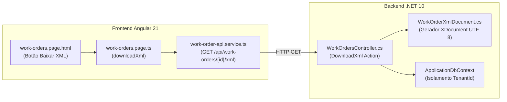

# Registro histórico — não define o estado atual

Preservado na consolidação documental de 13/09/2026. Prioridades e aceite atuais estão em [Status](../STATUS.md) e [Próximos passos](../NEXT-STEPS.md). Caminhos citados no corpo mantêm o contexto do arquivo original.

> **Escopo superado pela decisão posterior do usuário:** emissão oficial de NFS-e e NF-e de produtos, com A1 e integrações diretas. Consulte [fase 8](../phases/PHASE-08-FISCAL.md). O texto abaixo é preservado como proposta inicial; não implementar o XML próprio como substituto de nota fiscal.

# Plano de Implementação: Download de XML da Ordem de Serviço para a Contabilidade

## 1. Visão Geral e Objetivo

O objetivo desta entrega é permitir que o prestador de serviços (oficina mecânica / centro automotivo) realize o **download do arquivo XML estruturado de uma Ordem de Serviço (OS) finalizada**, a fim de enviá-lo ao seu departamento de contabilidade. 

O arquivo XML gerado segue o schema `ofizzy:work-order:v1`, fornecendo os dados cadastrais da oficina (emitente), cliente (tomador), veículo atendido e a segregação contábil completa entre **Mão de Obra / Serviços** (tributados por ISS municipal) e **Peças / Lubrificantes** (tributados por ICMS estadual / Substituição Tributária), permitindo ao escritório contábil apurar os impostos do Simples Nacional e importar os movimentos em softwares contábeis (Domínio Sistemas, Questor, etc.) sem digitação manual.

---

## 2. Decisão de Escopo e Arquitetura

* **Cenário Escolhido:** **XML Estruturado da OS (Etapa 1)**, gerado de forma 100% nativa pelo Ofizzy com custo zero e sem necessidade de Certificado Digital A1.
* **Isolamento e Segurança:** O endpoint respeita a arquitetura multi-tenant do Ofizzy (`[Authorize]`, `[TenantAccess]` e filtros globais do EF Core). Uma organização jamais acessa ordens de outra (retornando HTTP 404).
* **Zero Migrations:** Todas as informações consumidas pelo gerador já existem no banco de dados (`companies`, `customers`, `vehicles`, `work_orders`, `work_order_services`, `work_order_parts`).
* **Design System:** PrimeNG 21 travado na licença MIT (ADR 0005) e estilização baseada exclusivamente em variáveis CSS semânticas (`var(--surface-*)`, `var(--text-*)`, `var(--border-*)`), suportando Light e Dark mode.
* **Responsividade:** Botões com área de toque mínima de 44×44 px no mobile (≤ 640px) e sem overflow horizontal desde 320px.

---

## 3. Diagrama do Fluxo



---

## 4. Mudanças Propostas no Código

### 4.1. Backend (.NET 10)

#### [NEW] `src/backend/Ofizzy.Api/BusinessCore/WorkOrders/WorkOrderXmlDocument.cs`
Classe geradora do XML estruturado em UTF-8 com indentação, formatação decimal invariante (`CultureInfo.InvariantCulture`) e tratamento resiliente de campos nulos:

```csharp
using System.Globalization;
using System.Text;
using System.Xml.Linq;
using Ofizzy.Api.Infrastructure.Persistence;

namespace Ofizzy.Api.Modules.WorkOrders;

public static class WorkOrderXmlDocument
{
    private static readonly XNamespace Ns = "http://ofizzy.com/schema/work-order/v1";

    public static byte[] GenerateXmlBytes(WorkOrder order, TenantSettings company)
    {
        var inv = CultureInfo.InvariantCulture;
        var totalServices = order.Services.Sum(s => s.Quantity * s.UnitPrice);
        var totalParts = order.Parts.Sum(p => p.Quantity * p.UnitPrice);
        var grandTotal = totalServices + totalParts;

        var doc = new XDocument(
            new XDeclaration("1.0", "utf-8", "yes"),
            new XElement(Ns + "OrdemServico",
                new XAttribute("versao", "1.0"),
                new XElement(Ns + "Identificacao",
                    new XElement(Ns + "Numero", order.Number),
                    new XElement(Ns + "Status", order.Status.ToString()),
                    new XElement(Ns + "DataAbertura", order.CreatedAt.ToString("o")),
                    order.CompletedAt.HasValue ? new XElement(Ns + "DataConclusao", order.CompletedAt.Value.ToString("o")) : null
                ),
                new XElement(Ns + "Emitente",
                    new XElement(Ns + "RazaoSocial", company.LegalName ?? company.Name),
                    new XElement(Ns + "NomeFantasia", company.Name),
                    !string.IsNullOrWhiteSpace(company.Cnpj) ? new XElement(Ns + "CNPJ", company.Cnpj) : null,
                    !string.IsNullOrWhiteSpace(company.Phone) ? new XElement(Ns + "Telefone", company.Phone) : null,
                    !string.IsNullOrWhiteSpace(company.Email) ? new XElement(Ns + "Email", company.Email) : null,
                    new XElement(Ns + "Endereco",
                        !string.IsNullOrWhiteSpace(company.Address) ? new XElement(Ns + "Logradouro", company.Address) : null,
                        !string.IsNullOrWhiteSpace(company.City) ? new XElement(Ns + "Cidade", company.City) : null,
                        !string.IsNullOrWhiteSpace(company.State) ? new XElement(Ns + "UF", company.State) : null,
                        !string.IsNullOrWhiteSpace(company.PostalCode) ? new XElement(Ns + "CEP", company.PostalCode) : null
                    )
                ),
                new XElement(Ns + "Tomador",
                    new XElement(Ns + "Nome", order.CustomerName),
                    !string.IsNullOrWhiteSpace(order.CustomerDocument) ? new XElement(Ns + "Documento", order.CustomerDocument) : null,
                    !string.IsNullOrWhiteSpace(order.CustomerPhone) ? new XElement(Ns + "Telefone", order.CustomerPhone) : null
                ),
                new XElement(Ns + "Veiculo",
                    new XElement(Ns + "Placa", order.VehiclePlate),
                    new XElement(Ns + "Descricao", order.VehicleDescription),
                    order.Mileage.HasValue ? new XElement(Ns + "Quilometragem", order.Mileage.Value) : null
                ),
                new XElement(Ns + "Servicos",
                    new XElement(Ns + "TotalServicos", totalServices.ToString("F2", inv)),
                    order.Services.Select(s => new XElement(Ns + "Item",
                        new XElement(Ns + "Descricao", s.Description),
                        new XElement(Ns + "Quantidade", s.Quantity.ToString("F3", inv)),
                        new XElement(Ns + "ValorUnitario", s.UnitPrice.ToString("F2", inv)),
                        new XElement(Ns + "ValorTotal", (s.Quantity * s.UnitPrice).ToString("F2", inv))
                    ))
                ),
                new XElement(Ns + "Pecas",
                    new XElement(Ns + "TotalPecas", totalParts.ToString("F2", inv)),
                    order.Parts.Select(p => new XElement(Ns + "Item",
                        !string.IsNullOrWhiteSpace(p.Code) ? new XElement(Ns + "Codigo", p.Code) : null,
                        new XElement(Ns + "Descricao", p.Description),
                        new XElement(Ns + "Quantidade", p.Quantity.ToString("F3", inv)),
                        new XElement(Ns + "ValorUnitario", p.UnitPrice.ToString("F2", inv)),
                        new XElement(Ns + "ValorTotal", (p.Quantity * p.UnitPrice).ToString("F2", inv))
                    ))
                ),
                new XElement(Ns + "Totais",
                    new XElement(Ns + "SubtotalServicos", totalServices.ToString("F2", inv)),
                    new XElement(Ns + "SubtotalPecas", totalParts.ToString("F2", inv)),
                    new XElement(Ns + "ValorTotal", grandTotal.ToString("F2", inv))
                )
            )
        );

        using var ms = new MemoryStream();
        using (var writer = new System.Xml.XmlTextWriter(ms, Encoding.UTF8))
        {
            writer.Formatting = System.Xml.Formatting.Indented;
            doc.Save(writer);
        }
        return ms.ToArray();
    }
}
```

#### [MODIFY] `src/backend/Ofizzy.Api/BusinessCore/WorkOrders/WorkOrdersController.cs`
Adicionar action `DownloadXml`:

```csharp
    [HttpGet("{id:guid}/xml")]
    public async Task<IActionResult> DownloadXml(Guid id, CancellationToken ct)
    {
        var order = await db.WorkOrders
            .AsNoTracking()
            .Include(x => x.Services)
            .Include(x => x.Parts)
            .SingleOrDefaultAsync(x => x.Id == id, ct);

        if (order is null) return NotFound();

        var company = await db.TenantSettings.AsNoTracking().SingleAsync(ct);
        var bytes = WorkOrderXmlDocument.GenerateXmlBytes(order, company);

        return File(bytes, "application/xml; charset=utf-8", $"OS-{order.Number:D4}.xml");
    }
```

---

### 4.2. Frontend (Angular 21)

#### [MODIFY] `src/frontend/ofizzy-web/src/app/core/api/work-order-api.service.ts`
Adicionar método de requisição:
```typescript
  downloadXml(id: string): Promise<Blob> {
    return firstValueFrom(this.http.get(`/api/work-orders/${id}/xml`, { responseType: 'blob' }));
  }
```

#### [MODIFY] `src/frontend/ofizzy-web/src/app/features/work-orders/work-orders.page.ts`
Adicionar método `downloadXml` com Toast de feedback:
```typescript
  async downloadXml(order: WorkOrderSummary | WorkOrder): Promise<void> {
    try {
      const blob = await this.api.downloadXml(order.id);
      const url = window.URL.createObjectURL(blob);
      const a = document.createElement('a');
      a.href = url;
      a.download = `OS-${order.number.toString().padStart(4, '0')}.xml`;
      a.click();
      window.URL.revokeObjectURL(url);
    } catch {
      this.messages.add({
        severity: 'error',
        summary: 'Erro no download',
        detail: 'Não foi possível baixar o XML da OS.',
      });
    }
  }
```

#### [MODIFY] `src/frontend/ofizzy-web/src/app/features/work-orders/work-orders.page.html`
Incluir os botões "Baixar PDF" e "Baixar XML" no rodapé da visualização detalhada (`detailDialog`):

```html
        <div class="wo-footer-main-row">
          @if (order.status === 'Open') {
            <p-button label="Iniciar Atendimento" icon="pi pi-play" severity="info" (onClick)="status(order, 'InProgress')" />
          }
          @if (order.status === 'InProgress') {
            <p-button label="Finalizar OS" icon="pi pi-check" severity="success" (onClick)="status(order, 'Completed')" />
          }
          <p-button label="Imprimir" icon="pi pi-print" [outlined]="true" severity="secondary" (onClick)="printOrder()" />
          <p-button label="Baixar PDF" icon="pi pi-file-pdf" [outlined]="true" severity="secondary" (onClick)="downloadPdf(order)" />
          <p-button label="Baixar XML" icon="pi pi-file-code" [outlined]="true" severity="secondary" (onClick)="downloadXml(order)" />
        </div>
```

---

### 4.3. Documentação Técnica

#### [NEW] `docs/WORK-ORDER-XML-EXPORT.md`
Especificação completa do Schema XML `ofizzy:work-order:v1`, contexto fiscal de ISS e ICMS, arquitetura e instruções para contadores.

#### [MODIFY] `docs/API.md`
Registro do novo endpoint `GET /api/work-orders/{id}/xml`.

---

### 4.4. Testes Automatizados

#### [NEW] `src/backend/Ofizzy.UnitTests/WorkOrderXmlTests.cs`
Cobertura unitária validando nós do XML, cálculos de subtotais, escape de caracteres especiais e campos nulos.

#### [MODIFY] `src/backend/Ofizzy.IntegrationTests/TenantIsolationTests.cs`
Verificação de isolamento multi-tenant garantindo HTTP 404 em tentativas de acesso cross-tenant.

---

## 5. Roteiro de Validação e Verificação

### 5.1. Comandos de Teste
```bash
# 1. Backend Build e Testes Unitários + Integração (PostgreSQL Real)
dotnet test src/backend/Ofizzy.UnitTests --configuration Release
dotnet test src/backend/Ofizzy.IntegrationTests --configuration Release

# 2. Frontend Lint, Testes Unitários e Build de Produção
cd src/frontend/ofizzy-web
npm run lint
NODE_OPTIONS=--no-experimental-webstorage npm test -- --watch=false
npm run build

# 3. Testes E2E com Playwright
npm run e2e
```

### 5.2. Verificação Manual
1. Acessar `/ordens` e abrir uma OS finalizada.
2. Clicar em **"Baixar XML"** e inspecionar o arquivo `OS-0001.xml` gerado.
3. Clicar em **"Baixar PDF"** e validar o arquivo `OS-0001.pdf`.
4. Validar o layout no celular (320px) garantindo touch targets ≥ 44px e ausência de scroll horizontal.
